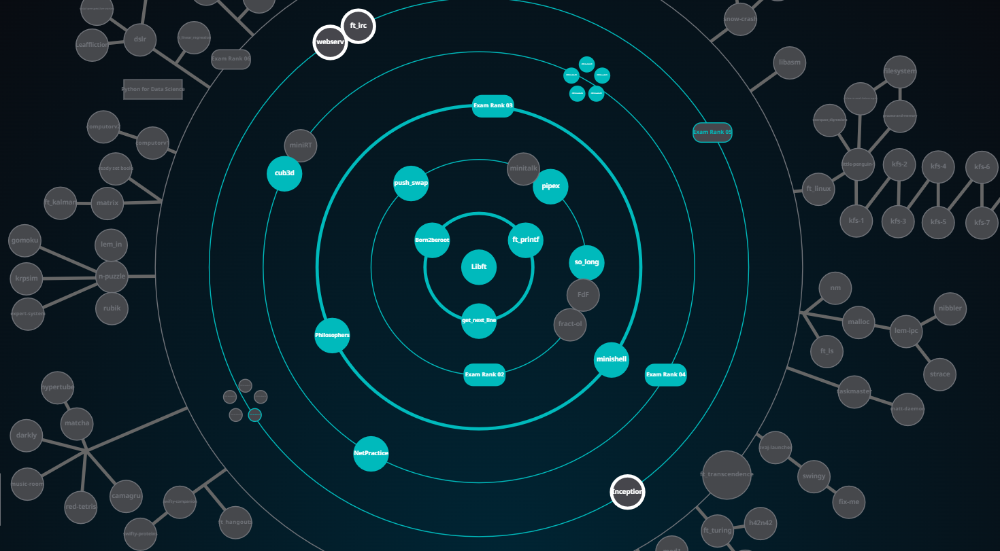

*I am a passionate engineer always willing to build or improve either a product, a system or a team, taking a leap forward to capture all opportunities. My main motivation is to keep learning and growing while dealing with the challenges that the current market and new technologies offer.*

### Join me in the journey to unlock the secrets of software engineering at 42 school!

---

## 42 Common Core Progress:

  

  

<!--
**ikersojo/ikersojo** is a ✨ _special_ ✨ repository because its `README.md` (this file) appears on your GitHub profile.

Here are some ideas to get you started:

- 🔭 I’m currently working on ...
- 🌱 I’m currently learning ...
- 👯 I’m looking to collaborate on ...
- 🤔 I’m looking for help with ...
- 💬 Ask me about ...
- 📫 How to reach me: ...
- 😄 Pronouns: ...
- ⚡ Fun fact: ...
-->
